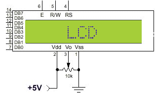
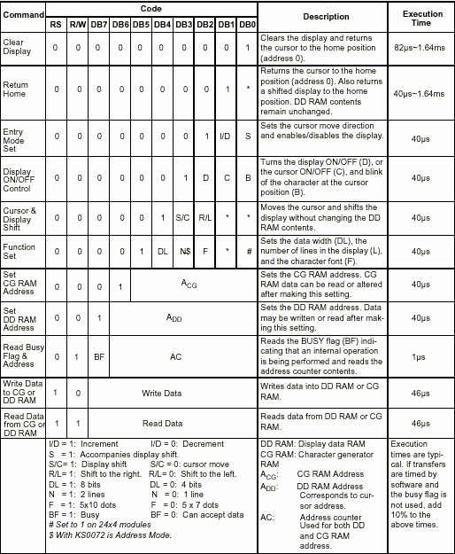

## HD44780

An HD44780 Character LCD is a de facto industry standard liquid crystal 
display (LCD) display device designed for interfacing with embedded systems.
These screens come in a variety of configurations including 8x1, which is 
one row of eight characters, 16x2,20×2 and 20x4, some include backlight 
provided by a LED.

Any parallelly interfaced character LCD you get these days will have a 
Hitachi HD44780 chip or a different one compatible with the HD44780. These 
usually have 14 pins.

[TOC] 

### HD44780 Schematic

### HD44780 Function Description
#### HD44780 Pin Description

| Pin Name       | Pin Description                                |
| :------------- | :--------------------------------------------  |
|D7 - D0         |Bi-directional data bus.                        |
|R/W             |Determines if we read from or write to the LCD  |
|RS              |Register select                                 |
|                |0: instruction register; 1:  data register      |
|E               |Enables or disables the LCD module.             |

#### Display Data RAM (DDRAM)

Display data RAM (DDRAM) is where you send the characters (ASCII code) you
want to see on the LCD screen. It stores display data represented in 8-bit
character codes. Its capacity is 80 characters (bytes). Bonus: The area in
display data RAM (DDRAM) that is not used for display can be used as general
data RAM. DD RAM address is the position of the cursor (i.e. where the data
you sent will be displayed). Below you see DD RAM address layout of a 2*16
LCD.

#### Registers

The HD44780 has two 8-bit registers, an instruction register (IR) and a data
register (DR). The IR stores instruction codes, such as display clear and 
cursor shift, and address information for display data RAM (DDRAM) and 
character generator RAM (CGRAM). The DR temporarily stores data to be 
written into DDRAM or CGRAM and temporarily stores data to be read from 
DDRAM or CGRAM. Data written into the DR is automatically written into DDRAM
or CGRAM by an internal operation. The DR is also used for data storage 
when reading data from DDRAM or CGRAM. These two registers can be selected
by the register selector (RS) signal. 

|RS  |R/W |Operation                                                |
|----|----|---------------------------------------------------------|
|0   |0   |R write as an internal operation (display clear, etc.)   |
|0   |1   |Read busy flag (DB7) and address counter (DB0 to DB6)    |
|1   |0   |DR write as an internal operation (DR to DDRAM or CGRAM) |
|1   |1   |DR read as an internal operation (DDRAM or CGRAM to DR)  |

#### Busy Flag(BF)
When the busy flag is 1, the HD44780U is in the internal operation mode, 
and the next instruction will not be accepted. When RS = 0 and R/W = 1 
(see the table above), the busy flag is output to DB7 (MSB of LCD data bus).
The next instruction must be written after ensuring that the busy flag is 0.

#### Address Counter (AC)

The address counter (AC) assigns addresses to both DDRAM and CGRAM. When 
a "set DD RAM/CG RAM address" instruction is written into the IR, the 
address information is sent from the IR to the AC. Selection of either 
DDRAM or CGRAM is also determined concurrently by the instruction. After 
writing into (or reading from) DDRAM or CGRAM, the AC is automatically 
incremented (or decremented) by 1 . The AC contents are output to DB0 to DB6
when RS = 0 and R/W = 1 (see the table above). To see the effects of setting
the address counter to increment or decrement.

#### To display a character

positional data is written into IR (DDRAM address). A character code is then
written into DR and the LCD unit displays the corresponding pattern at the
specified location. The LCD unit can either increment or decrement the 
display position after each character entry, so that only successive 
character codes need to be entered to display a continuos character string.

#### Commands

### API Group

#### Config API

- HD44780Init() to initialize.
- HD44780EntryModeSet() to set the entry mode.

#### Display API

The display is turned on/off by:
- HD44780DisplayOn()
- HD44780DisplayOff()

The display is cleared by HD44780DisplayClear().

Print something on the LCD:
- HD44780DisplayString()
- HD44780DisplayN()

Shift the entire display by:
- HD44780DisplayLeftShift()
- HD44780DisplayRightShift()

#### Location API

- HD44780Home() - return (0,0)
- HD44780LocationSet() - move to (x, y)

#### Cursor API

Cursor is turned on/off:
- HD44780CursorOn() - set the cursor style and turn on the cursor.
- HD44780CursorOff()

Move the curosr:
- HD44780CursorLeftMove()
- HD44780CursorRightMove().

#### Lowlayer API

If the LCD API can not meet your need, you can use the API below operated 
on the lowlayer.
- HD44780Busy()
- HD44780WriteCmd()
- HD44780WriteData()
- HD44780ReadState()
- HD44780ReadData()

### HD44780 Usage

Before Using the LCD driver, you should configure the LCD moudle, function,
character font, data interface length, pin remap. P

Below is some example code:

~~~c
void HD44780Test(void)
{
    int i , j;
    
    HD44780Init();
    
    //
    // Location Set & Display string, number Test
    //
    HD44780LocationSet(0, 0);
    HD44780DisplayString("Hello HD44780!");
    HD44780LocationSet(0, 1);
    HD44780DisplayString("Number:");
    HD44780DisplayN(10086);
    xSysCtlDelay(xSysCtlClockGet() / 4);
    HD44780LocationSet(0,1);
    HD44780DisplayString("Display off/on");
    xSysCtlDelay(xSysCtlClockGet() / 4);
    HD44780DisplayOff();    
    xSysCtlDelay(xSysCtlClockGet() / 4 );
    HD44780DisplayOn();
    xSysCtlDelay(xSysCtlClockGet() / 4);
    //
    // Cursor style
    //
    HD44780DisplayClear();
    HD44780DisplayString("Cursor Test");
    HD44780CursorOn(xfalse);
    xSysCtlDelay(xSysCtlClockGet() / 4);
    HD44780CursorOff();
    xSysCtlDelay(xSysCtlClockGet() / 4);
    
    //
    // Cursor will blink at the end of line
    //

    HD44780CursorOn(xtrue);
    HD44780CursorRightMove(1);
    xSysCtlDelay(xSysCtlClockGet() / 4);
    HD44780CursorRightMove(5);
    xSysCtlDelay(xSysCtlClockGet() / 4);
    HD44780CursorLeftMove(4);
    xSysCtlDelay(xSysCtlClockGet() / 4);
    
    for(i = 0; i < 10; i++)
    {
        HD44780CursorRightMove(1);
        xSysCtlDelay(xSysCtlClockGet() / 10);     
    }
    
    for(i = 0; i < 10; i++)
    {
        HD44780CursorLeftMove(1);
        xSysCtlDelay(xSysCtlClockGet() / 10);     
    }    

    HD44780LocationSet(0, 1);
    HD44780DisplayString("Cursor Home");
    xSysCtlDelay(xSysCtlClockGet() / 4);
    
    HD44780Home();

    //
    // Display Right shift
    //

    HD44780DisplayClear();
    HD44780DisplayString("Right scrolling string");
    HD44780LocationSet(0, 1);
    HD44780DisplayString("        Line 2         ");
    for(i = 0; i < 20; i++)
    {
        HD44780DisplayRightShift(1);
        xSysCtlDelay(xSysCtlClockGet() / 10);
    }
    
    //
    // Display Left shift
    //
    HD44780DisplayClear();
    HD44780DisplayString("Left scrolling string");
    HD44780LocationSet(0, 1);
    HD44780DisplayString("        Line 2         ");
    for(i = 0; i < 20; i++)
    {
        HD44780DisplayLeftShift(1);
        xSysCtlDelay(xSysCtlClockGet() / 10);
    }
    
    //
    // Display Right Left shift    
    //
    HD44780DisplayClear();
    HD44780DisplayString("Left Right scrolling string");
    HD44780LocationSet(0, 1);
    HD44780DisplayString("        Line 2         ");    
    for(j = 0; j < 2; j++)
    {  
        for(i = 0; i < 10; i++)
        {
            HD44780DisplayRightShift(1);
            xSysCtlDelay(xSysCtlClockGet() / 10);
        }
        for(i = 0; i < 10; i++)
        {
            HD44780DisplayLeftShift(1);
            xSysCtlDelay(xSysCtlClockGet() / 10);
        } 
    }
    HD44780Home();
    xSysCtlDelay(xSysCtlClockGet() / 4);
    
    //
    // Cursor Move Direction
    //
    HD44780DisplayClear();
    HD44780LocationSet(10, 1);
    xSysCtlDelay(xSysCtlClockGet() / 4);
    HD44780EntryModeSet(HD44780_MOVE_DIRECTION_DEC, xfalse);
    HD44780DisplayString("DEC");
    
    HD44780LocationSet(10, 2);
    xSysCtlDelay(xSysCtlClockGet() / 4);
    HD44780EntryModeSet(HD44780_MOVE_DIRECTION_DEC, xtrue);
    HD44780DisplayString("DEC shift");
    
    HD44780DisplayClear();
    HD44780LocationSet(10, 1);
    xSysCtlDelay(xSysCtlClockGet() / 4);
    HD44780EntryModeSet(HD44780_MOVE_DIRECTION_INC, xfalse);
    HD44780DisplayString("INC");
    
    HD44780LocationSet(10, 2);
    xSysCtlDelay(xSysCtlClockGet() / 4);
    HD44780EntryModeSet(HD44780_MOVE_DIRECTION_INC, xtrue);
    HD44780DisplayString("INC shift");
    xSysCtlDelay(xSysCtlClockGet() / 4);
    
    HD44780DisplayClear();
    HD44780EntryModeSet(HD44780_MOVE_DIRECTION_INC, xfalse);
    HD44780DisplayString("Complete");
        
}
~~~

