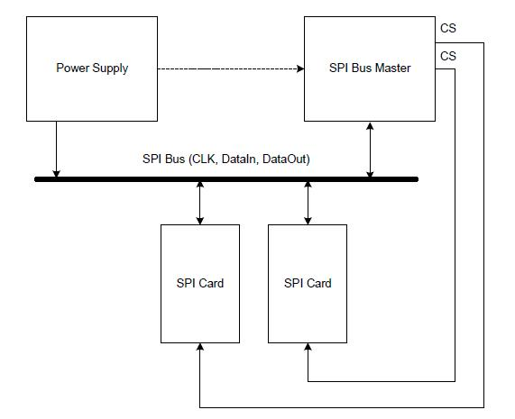
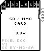

@if (DOXYGEN_PROJECT)
@defgroup SDCard
@endif

# SD Memory Card

SD Memory Card is a memory card that is specifically designed to meet the 
security, capacity, performance, and environment requirements inherent in 
newly emerging audio and video consumer electronic devices.

SD and MMC cards support various protocols, but common to them all is one
based on SPI. This is the one our driver use. It uses a generic SPI 
interface so will be more portable.

## 1. SDCard Bus Circuitry Diagram

## 2. SDCard Function Description
### 2.1 SDCard Pin Description(SPI Mode)

<pre>
+---+-------+-------------------------------+
|No.|PinName|Pin Description                |
|---|-------|-------------------------------|
| 1 |CS     |Chip Select (active low)       |
| 2 |DataIn |Host-to-card Commands and Data |
| 3 |VSS1   |Supply voltage ground          |
| 4 |VDD    |Supply voltage                 |
| 5 |CLK    |Clock                          |
| 6 |VSS2   |Supply voltage ground          |
| 7 |DataOut|Card-to-host Data and Status   |
| 8 |RSV4   |Reserved                       |
| 9 |RSV5   |Reserved                       |
+---+-------+-------------------------------+
</pre>

### 2.2 Memory Read Write

SD Cards are block devices. That means you read/write data in multiples 
of the block size (usually 512-bytes); the interface is basically "read 
from block address n", "write to block address m". 

## 3. SDCard Usage

Before Using the SDCard driver, you should configure the SDCard, such as 
pin map, if enable CRC function and so on. Please reference
\ref SDCard_Config.

~~~~c
#include "sdcard.h"
#include "xhw_debug.h"

void SDCardTest(void)
{   
    unsigned long i;
    unsigned char ucRet;
    const tSDCardDeviceInfo * psSDCardInfo;
    static unsigned char pucWrBuf[512] = {0};
    static unsigned char pucRdBuf[512] = {0};
    
    //
    // Step1: SD Card Init
    //
    ucRet = SDInit();
    xASSERT(ucRet == SD_NO_ERR);
    
    //
    // After initialize complete, you can get the Card Info, so you know 
    // the total block number, CID and so on
    //
    psSDCardInfo = SDCardInfoGet();
    
    //
    // Fill the test buffer(1 block)
    //
    for(i = 0; i < 512; i++)
    {
        pucWrBuf[i] = i % 256;
    }
    
    //
    // Write a block to the card 
    //
    ucRet = SDBlockWrite(pucWrBuf, 0);
    xASSERT(ucRet == SD_NO_ERR);
    
    //
    // Read 1 block from the card
    //    
    ucRet = SDBlockRead(pucRdBuf, 0);
    xASSERT(ucRet == SD_NO_ERR);
    
    //
    // Check Write == Read?
    //
    for(i = 0; i < 512; i++)
    {
        xASSERT(pucWrBuf[i] == pucRdBuf[i]);
    }   
}
~~~~

